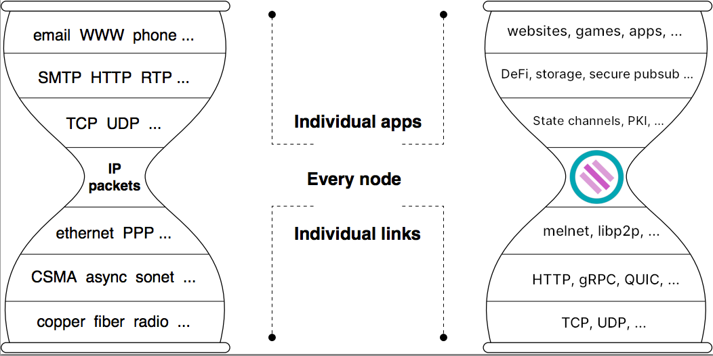

# Themelio overview

## What is Themelio?

Themelio is technology that enables open, secure, and decentralized apps that work reliably and can't be taken down, like Mel, an independent, stable-value cryptocurrency that anyone can use freely. It's a public blockchain, and it's inspired by the foundation laid by previous blockchains like Bitcoin and Ethereum, but it takes a radically different design direction inspired by that of the Internet.

Traditional blockchains, like pre-Internet telecom protocols, implement one application or try to provide a comprehensive solution to all use cases. Themelio, on the other hand, is designed as a radically simple, stable, and long-term foundation that can power a vast and diverse ecosystem precisely because it focuses only on the functionality that all apps need. We envision Themelio to play a role in the security infrastructure of a new and decentralized Internet as fundamental and ubiquitous as that of IP, the [protocol from 1983](https://tools.ietf.org/html/rfc791) that still underpins Internet communication.

## Stability: the heart of Themelio

Themelio's central mission is to be a **stable root of endogenous trust**. Endogenous trust, or trust that emerges from within the protocol rather than from the people who run it,  is the "killer feature" of blockchains. It lets us quantify trust in a blockchain with _minimal assumptions about who runs it_. This blockchains from all previous protocols, including decentralized and federated ones like BitTorrent and IRC. By focusing on this one aspect of blockchains and implementing it exceptionally well, Themelio aims to support a new "blockchain-minimal" paradigm of decentralized Internet apps.

Yet endogenous trust is shaky without _stability_. Unstable protocols needing regular tweaks make "governance" --- _exogenous_ interventions in the protocol --- necessary to blockchains. Unstable cryptocurrencies make securely storing and measuring value on the blockchain difficult, spawning a decentralized finance \(DeFi\) ecosystem heavily reliant on fiat-pegged stablecoins, oracles, and other instances of exogenous trust. And unstable, unintuitive behavior, such as fee levels that vary wildly over time, error-prone smart contract VMs, and nondeterministic consensus, make developing secure applications that correctly leverage the blockchain's endogenous trust rather than exogenous trust in thid parties surprisingly difficult. It comes to no surprise, then, that Themelio's most important design decisions are focused on stability.

### Stable protocol 

The first, most important pillar of Themelio's stability is its stable protocol. Themelio's core blockchain logic is much simpler than other general-purpose blockchains like Ethereum and Tezos. It uses a rudimentary-seeming transaction model based on spending coins \(i.e. unspent transaction outputs, or UTXOs\), augmented with a small, carefully selected set of additional features that empowers entire application classes impossible with conventional coin-based blockchains like Bitcoin and Litecoin. 

The two most important of these "superpowers" are MelVM and state commitments. MelVM is a non-Turing-complete virtual machine that nevertheless can compute all [primitive recursive functions](https://en.m.wikipedia.org/wiki/Primitive_recursive_function) and enables attaching sophisticated **covenants** to coins, powering on-chain protocols like tokens and financial instruments without the pitfalls of stateful smart contracts. State commitments use [sparse Merkle trees](https://ethresear.ch/t/optimizing-sparse-merkle-trees/3751) to commit in the block header all information needed to validate transactions, like the set of all unspent coins, enabling scaling strategies crucial to global adoption, such as fully validating nodes with limited storage space and thin clients that can securely verify much more information than conventional techniques like Bitcoin's SPV allows.  

### Stable cryptocurrency

The second pillar of Themelio's stability is Mel, its base cryptocurrency. Mel is the first ever **endogenous stablecoin**: a cryptocurrency that keeps a relatively stable purchasing power without pegs to external assets like the US dollar. The purchasing power a mel is backed by Melmint, an equity-based stablecoin mechanism similar to Basis and Seigniorage Shares, with two crucial differences:

* Instead of a price oracle, we use an auction mechanism to measure the on-chain value of a _day of sequential computation_, or "DOSC". The value of 1 DOSC at a given time is the cost of 24 hours of sequential computation on the fastest processor available at that time --- a value that maintained surprisingly stable purchasing power over the last two decades. This frees Mel entirely from external trust in oracles and fiat currency. 
* Instead of shares backed by future stablecoin issuance, Melmint issues Sym, Themelio's proof-of-stake token, to support the mel's value in times of decreasing demand. This eliminates "death spiral" scenarios common in dual-token stablecoin mechanisms and ensures Mel's stability as a blockchain's base currency even when issuance is expected to decline.  

We've published Melmint as a [peer-reviewed paper at Cryptoeconomic Systems 2020](https://cryptoeconomicsystems.pubpub.org/pub/2ggmf2k0/release/4), and a [further revised version](melmint-trustless-stable-cryptocurrency.md) is available here for those interested in the technical details of Melmint. 

### Stable behavior

Finally, stable behavior during blockchain operation is crucial to developing apps that leverage endogenous trust reliably and securely. This is largely supported by **Synkletos**, the cryptoeconomic protocol that secures Themelio's consensus and powers its on-chain fee economy.

Synkletos is based on Byzantine fault-tolerant proof-of-stake consensus between "stakers" with a separate token, Sym, that pays dividends from transaction fees and is fixed-issuance like traditional cryptocurrencies. By using BFT consensus, Synkletos ensures that transactions are either fully confirmed or not present in the blockchain, eliminating the complex latency-dependent guesswork required in "chain-based" blockchains like Bitcoin and Ethereum when deciding whether or not to permanently trust a transaction.

Furthermore, unlike present blockchains' fee systems, Synkletos drives staker income largely from stabilized, market-determined fees rather than inflation-based block rewards. This aligns incentives between stakers and users, making collusion between stakers to subvert the protocol unprofitable even when there are very few stakers, while making fees much stabler and fee estimation trivial.

You can find a [detailed treatment of Synkletos](synkletos-themelios-collusion-resistant-consensus-mechanism.md) right here in this knowledge base.  

## Get started now!

Right now, Themelio has just launched its **alphanet**. This gives us a proof-of-concept to tinker with that nevertheless you can participate in. At this point, development is highly "agile" and prioritizes flexibility over stability.

To get started, you can learn more about Themelio in this knowledge base, [join our Discord channel](https://discord.gg/MzzffF7v2E), or try transacting with some placeholder "Monopoly money" with our [alphanet wallet](getting-started-with-the-alphanet.md). 

