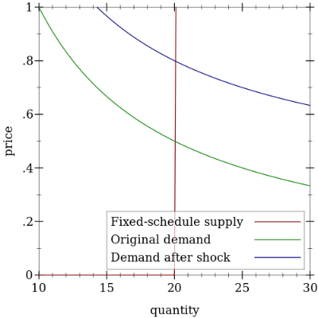
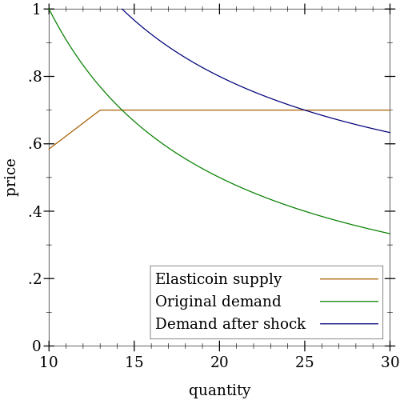
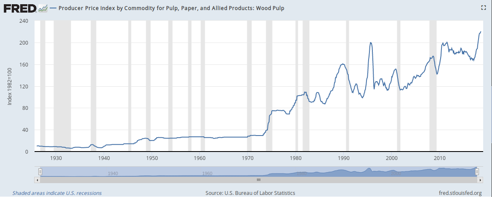
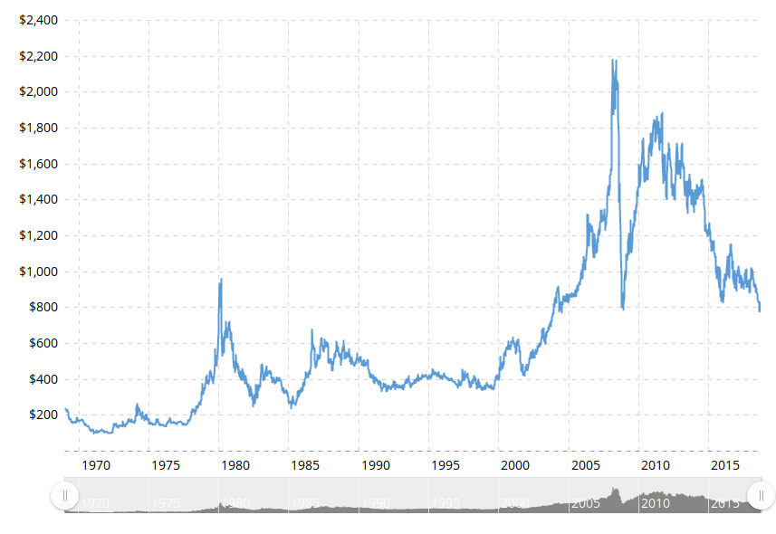

# Mel - a reasonably stable cryptocurrency

## Motivation

Currently popular cryptocurrencies such as Bitcoin and Ethereum tend to have really volatile prices, making them poor stores of value and units of account. The obvious problem this causes is the difficulty of offering goods and services denominated in, say, BTC, but a more significant problem is that such an unstable currency makes it impossible to have a functioning financial ecosystem --- any financial instruments denominated in BTC would be incredibly volatile, and people buying, say, BTC-denominated bonds would be more speculating on the future value of BTC than providing liquidity to somebody else.

Thus, it's clear that a decentralized currency with a stable value will fulfill a very significant need in the market. 

## Stablecoins: the existing approach

Existing approaches at creating a stable-value cryptocurrency focus on _pegging_ it to a real-world asset, generally the USD. In fact, **stablecoins** are often defined simply as on-chain assets pegged to real-world ones. Let's examine some existing approaches to creating such pegged stablecoins:

### Asset-backed currency board

This includes examples like **Tether** and **TrueUSD**. We simply have a centralized entity acting as a currency board, taking deposits in fiat and issuing blockchain-traded IOUs.

The most obvious advantage is that with a trustworthy, reliable currency board, exchange rates will be extremely stable. No sort of "black swan" economic shock would ever break the peg as long as the currency board stays solvent, which is not hard.

The biggest problem, of course, is counterparty risk: if the currency board is compromised, dishonest, or shut down by governments, the currency will instantly collapse. HKD will not retain value if the HKMA disappears off the face of the planet. Furthermore, it gives currency boards like Tether's operating company a huge pile of cash --- it would be very hard to resist the temptation to invest or speculate with the backings and make the system secretly fractional-reserve, as Tether is often suspected of doing, further increasing counterparty risk.

### Collateralized debt

The most notable stablecoin in this category is **MakerDAO**. These stablecoins are backed with _on-chain_ assets: Dai, for example, is backed with ETH. An on-chain smart contract manages currency supply, rather than a centralized bank, and each stablecoin represents a debt of a loan backed by their cryptoassets. 

The central idea is that the currency is over-collateralized: each coin is issued only against a debt much more than its face value in cryptoassets. For example, a new stablecoin pegged to the USD may be issued only when a user deposits $2 worth of ETH. This hedges against risks in the collateral crashing, at the cost of making it difficult to see why anybody would want a stablecoin: the answer typically is that this coin can be used as a tool to margin-trade on the underlying cryptoasset. To maintain stability, whenever the price falls below the peg, collateral would be used in indirectly to buy up stablecoins, and if the stablecoin is in danger of become undercollateralized all the collateral would be split up between the users.

There are several fairly salient problems with this approach. For example, scalability could be a concern: the competitiveness of the stablecoin against centralized margin-trading solutions is questionable, and this may cause problems related to a restricted money supply. In addition, there is little downward pressure on the trading price between the face value, which may cause much more volatility than a "proper" currency-board peg. Finally, the stability of the coin during black-swan crashes of backing collateral is extremely questionable.

\(A straightforward translation to the world of fiat currencies would be a central bank trying to maintain a peg to the USD, but having foreign exchange reserves only in unrelated things like gold and stocks. It does not inspire nearly as much confidence as a currency board with 1:1 USD reserves\) 

### Seigniorage shares

In the seignorage shares scheme, there are two currencies: volatile shares, and pegged coins. An automatic central bank prints coins to buy shares when the price of the coin is higher than the peg, or prints shares to buy coins. Shares in this scheme essentially entitle the bearer to fractions of the future seignorage of the currency. It is sometimes claimed that this approach, with no explicit reserves, can be used to target any exchange rate with any commodity.

One problem with this approach is that the implict backing for the issued currency is "how much dollars we can get by auctioning an unlimited amount of shared". This value is _not_ infinite, and is could be less than the amount of currency issued whenever confidence in the currency falls, causing a death spiral as the market loses confidence that the peg will ever recover. 

Seigniorage shares may be _fundamentally_ flawed. Expected future seignorage can easily crash due to normal market fluctuations (say: expected long-run inflation of the dollar with regards to stablecoin demand falls, requiring a decrease in money supply to maintain dollar value in the long run). This will remove the implicit backing of the currency and easily lead to a panic.

Transplanting this idea to the fiat world shows its problems more clearly. If seignorage shares could back a hard peg, central banks targeting an exchange rate would never need capital controls, foreign exchange reserves, etc. They would be able to pursue an independent monetary policy, and all they have to do is buy or sell securities backed by future seignorage to counteract any movements in the price of the currency. This violates the "impossible trinity" and intuitively sounds hopelessly circular.

Surprisingly, seignorage shares does not seem to have a concrete deployment. The discontinued "Basis" project is close to seignorage shares, but it adds some fatal flaws of its own, notably adding "bonds" redeemable only when seignorage happens. As Preston Byrne [more abrasively puts it,](https://prestonbyrne.com/2017/10/13/basecoin-bitshares-2-electric-boogaloo/)

> \[...\] the structure their “white paper” puts forward, which can be summarised as "_I create a coin, which will always revert to a market price of $1 per coin regardless of quantity demanded, backed by bonds which I issue, which are denominated in the coins I just created, and redeemed for coins I will later create"_ – is **recursive**_,_ or the **financial equivalent of a perpetual motion machine**.

## Can stablecoins work?

### Pegging to an asset without holding that asset

Stablecoins appear to involve a fundamental centralization/stability tradeoff: currency boards are stable if you trust the central bank to do its job and not be shut down, but other solutions have uncertain pegs, with seigniorage shares having an especially suspect stabilization mechanism. 

A decentralized-issuance stablecoin can be reduced to the problem of directing a central bank to hold a 1:1 peg with USD without holding any USD --- since holding real USD is impossible on-chain --- under realistic market conditions. The difficulty of doing so in the world of fiat currency, despite many governments wishing to maintain pegs without sound reserves in the right currency, suggests that in the world of decentralized currencies it may be impractical too.

### Incentive problems with price feeds

Perhaps a more severe issue lies in the reliance of any stablecoin on a reliable, uncorruptible feed of exchange rates with an off-chain asset: Dai, for example, has a pool of oracles posting the ETH/USD exchange rate. This oracle, for obvious reasons, is very difficult to decentralize. Generally, coinholders either appoint a number of semi-trusted oracles in a dPoS-like scheme, or vote for what they think is the latest exchange rate in an incentivized Schelling-point game. The problem with both of these approaches is that _incentives_ for a secure feed feed are very difficult to design.

For the delegated-oracle approach, consider the case where a USD-linked stablecoin's holders delegate votes to oracles. An attacker can set up an oracle consistently reporting that stablecoins are trading below the peg. All coinholders would then benefit from voting for this fake oracle, since if this oracle ends up taking control of the price feed, the automatic central bank will think it needs to reduce coin supply, driving up coin prices. The coinholders would kill their own currency with no need for external coercion or bribery.

For a naive Schelling-point approach, a classic $$P+\epsilon$$ [attack](https://blog.ethereum.org/2015/01/28/p-epsilon-attack/) will work very well. In addition, if the voting is based on coin weight, a Schelling-point system is likely to degenerate into a delegated-oracle approach, since individual users are likely to simply parrot the listed price of a major exchange. In this case, the attacker can set up a price feed that would change to a fake, below-peg exchange rate _only if a certain threshold of clients connect to it_. Clients would willingly switch to the attacker's feed, and the same problem will occur as in the delegated-oracle approach.

Some sort of incentive-compatible price feed might be possible, but it does not seem intuitively likely. It seems like as long as whoever decides the price feed has an interest in the coin going either up or down, no matter how minuscule, all bets are off. Perfectly balancing incentives are difficult to come up with, especially since subjective valuation of losses and gains are typically asymmetrical and erratic \(for example, a scheme where stakeholders benefit 100% with probability 1% if the coin depreciates while benefiting 1% with certainty if the coin appreciates won't work\)

## First try: Elasticoin

### Inelastic supply of coins

Why exactly do most cryptocurrencies have such a volatile price? The biggest reason is probably _inelastic supply of new coins_. Coins in a traditional cryptocurrency are mined according to a fixed schedule, independent of market conditions such as the demand for new coins. Thus, volatility in the demand for coins, due to factors such as adoption events, exchange crashes, etc causes large swings in the price of a coin.



The picture above illustrates this: a shift in the demand curve causes a large, proportional shift in the equilibrium price.

### Fixed-cost minting with Elasticoin

In ICBC 2019, we presented our first "stableish-coin" mechanism, Elasticoin. As its name suggests, Elasticoin simply aims to *maximize supply elasticity*. This fixes the fundamental issue we identified with fixed-schedule coins. Elasticoin achieves supply elasticity by **fixing the cost of minting**. Mels are currently minted using Elasticoin on the Themelio alphanet.

In contrast to usual cryptocurrencies, mels are _minted_ using a novel system known as **proportional-reward proof-of-sequential-work** \(PRPoSW\). The details are radically different from usual cryptocurrency issuance methods, but the gist of it is that by using a primitive known as a non-interactive proof of sequential work, minters create mels at the fixed rate of 1 mel per 1 day of single-core computation on a current CPU. The definition of "current CPU" is also continually and automatically updated based on actually observed minting activity with no oracle intervention.

Thus, assuming that "days of CPU time" has a stable value, minters in Themelio pay _constant per-unit costs_ when currency is created, measured in a non-gameable unit disconnected from any trusted parties. Minters will supply an unlimited number of mels for any above-cost price, while supplying nothing for below-cost prices. This makes the supply of mels very elastic, giving much smaller price changes during demand shocks, especially upward ones, though it is not _perfectly_ elastic, considering the contribution of "old" mels to the supply during a downturn in demand where new mels are not in demand. We get a picture more like this, assuming a cost of minting of around 0.7 units:



It's important to note that this sort of elasticity is very common in real life currencies, both commodity and fiat. Central banks obviously print a lot more money during times of increased demand for currency, but even the supply of gold is not entirely inelastic: changes in demand for gold certainly do result in more or less gold production, as gold takes resources to extract and does not fall down from the sky. 

There is also significant evidence that commodities with relatively elastic original supplies \(such as paper\) have much stabler prices than commodities with inelastic supply \(such as precious metals\), even if the "second-hand" market dominates. 





## Is Elasticoin enough?

Is Elasticoin sufficient for holding the price of a coin close to its minting cost? The picture on top appears to show that as long as demand doesn't fall below the "knee" in the supply curve, the price will stay stable. Unfortunately, this is very misleading. 

The reason is that total money supply cannot be reduced during periods of low demand. Thus, as demand increases beyond the "knee", the "knee" will follow the intersection of the demand and supply cuve, but when demand falls, the "knee" will stay at at a higher level while the price falls.

This does not mean that Elasticoin is pointless though. Elasticoin's main stabilizing is *not* in fact keeping the equilibrium price in a regime where the supply is infinitely elastic. Instead, it stabilizes prices largely by cutting off speculative demand: the histogram of future possible prices no longer contains any prices above the minting cost, and this reduces the attraction of mel speculation enough that the much more organically and predictably growing consumptive demand can take over. Under a model where Elasticoin demand slowly but surely grows, mel prices will be very stable, and dips in price will be small.

However, there doesn't mean we can't do a lot better. We can in fact use the central insight of Elasticoin --- than an endogenous price signal can be built using NIPoSW --- to build a much more robust "semi-stablecoin".

## ~~Seigniorage~~ Shares, all over again

Recall that in Themelio, just like a seigniorage-shares system, has both shares (mets) and coins (mels). The similarities end here though, as mets in Themelio are much closer to true equity positions, giving holders both consensus voting power and revenue captured by the system through fees and rewards. However, we can use such a valuable, albeit short-run volatile, asset to design a semi-stable coin.

We first construct a *price feed* that gives an accurate current exchange rate between computation power and mels. This is done through the following process:

- Elasticoin is used verbatim to mint **ergs** representing units of sequential computation.

- Ergs circulate on-chain like any other currency, with the exception that a punitive 1% per block demurrage applies.

- A small amount of mels are printed *ex nihilo* and auctioned off for ergs, which are then destroyed.

- The erg/mel exchange rate thus established is then considered the computation/mel exchange rate.

We then create a monetary policy regime that targets a 1:1 erg/mel exchange rate.

- When the mel price rises above 1 erg/mel, we simply allow free conversion of ergs into mels. This becomes the original Elasticoin system and keeps down the mel price.

- When the mel price falls below 1 erg/mel, we do a **met dilution**. New mets are rapidly created and auctioned off for mels until the mel price returns to normal. This effectively expropriates met-holders, a risk that would be baked into the market's valuation of mets.

The important thing to note there is that **the met market cap is disconnected from seignorage or other monetary-policy tools**. Instead, it's based on the discounted expected revenue stream of fees and block rewards, which is tied to the long-term economic activitiy level of Themelio. Thus, shocks to mel demand by themselves will not cause the spiraling peg collapse that threatens seignorage shares.

Thus, in this system, the **mets in circulation** are the implicit reserves backing mel value.

#### A back-of-the-envelope stability calculation

We conclude with a simple modeling of the stability of the system. Let's conservatively assume that the "taxes" collected by the Themelio protocol that ultimately accrue to stakeholders annually amount to 1% of the on-chain economic activity. Thus, if G is the total economic activity, then under a 3% discount rate then the NPV of all the mets is 0.32G. 

How much liquid money does an economy need? The USD M1/GDP ratio has always stayed around 0.2. Mels have a consumptive use and lacking a central bank interested in monetary inflation would likely generate even smaller equilibrium money supplies. Even assuming that 0.2G worth of mels are in circulation, the met market cap is still more than sufficient to back all the mels.

Of course, in a smaller economy it's very likely that significantly more than 1% of activity accrues to stakeholders, making the stabilization even safer.

(Note that *seigniorage* shares rather then equity shares cannot hope to capture nearly as much revenue --- 1% GDP or more seignorage every year is far too high to avoid hyperinflation)

## Two problems

### Continual met dilution

Initially, stakeholders assume a negligible chance of expropriation. But when we hyperinflate mets to offset sudden mel dumping, this can set off a panic where the discount rate for calculating the NPV of a met skyrockets, destroying met value and with it mel backing. This can happen even if stakeholders know that the mel dumping is irrational and demand will stabilize in the future.

We need some way of assuring that mets in the long run revert to the mean. This means that we do in fact need to borrow the concept of seigniorage shares.

### How to properly do a mel auction

Use Elasticoin to mint demurraging ergs that people can use to bid in mel auctions.

The problem is that the market may be extremely thin, dominated by one "irrational" guy in his basement sitting on a pile of free electricity. This causes issues of mels being overvalued in the mel/erg market.

This means that we must have some way of allowing arbitrage to make irrational behavior unboundedly costly.

## A complete description

### Mel auction

The first part of our mechanism is the *mel auction*. Every 100 blocks (50 mins), m$ mels are created and auctioned off. This is done for a temporary currency known as the *erg*. Every erg (1000$ milliergs, the on-chain unit) is created through wasting 24 hours of recent sequential computation as defined using the Elasticoin algorithm, while the value of each erg coin depreciates by 0.1% rounded up every single block. This halves the value of every erg coin around every 700 blocks, or 5 hours 50 minutes, forcing users to quickly participate in auctions.

This is done through a very simple first-price non-sealed auction. Anybody can submit specially-typed **bid transactions**. Bid transactions have the following invariants:

- The "kind" is set to a magic value

- Output 0 is denominated in ergs and is the amount of ergs that the bidder wishes to pay for the nanomels. This is locked until the end of the auction (if the auction is at block 100, only spendable after block 201).

- Output 1 is denominated in mels and is the amount mels the bidder wishes to buy. This mel is excess above the amount input to the transaction, and is locked until the end of the auction.

Bids are accepted over the 100 blocks until the next auction. At the beginning of the next auction, new mels are minted to fill bids.

Bids are filled from the highest to lowest price, with TXID acting as a tiebreaker, while skipping over any bids that are too big:

```lua
for bid in bids:    if bid.size <= remaining_to_auction:        fill(bid)
```

To fill a bid, a synthetic **mint transaction** is created on the blockchain. Mint transactions have the following invariants:

- They spend Output 0 of the bid transaction they are filling and no other outputs

- They can always spend a bid transaction regardless of its script hash.

To reject a bid, we synthesize a special **reject transaction** that simply destroys Output 1 before it can be spent.

Both mint and reject transactions are entirely synthetic, in the sense that nobody may actually broadcast them and their existence is entirely predictable from other state. We use transactions instead of sudden changes in state to preserve more general properties of the blockchain (like a TXID committing to the entire relevant state history).

### The control loop

Every new auction, we calculate a value \Delta_m. This is the value we adjust $m$ by to maintain a 1 erg/mel price.

At the end of each auction, we take the average mel price in ergs/mel (that is, all ergs destroyed / all mels created) as $p$. If p>1 we set \Delta_m=0.01m, while if p<0.95 we set $\Delta_m=-0.01m$.

This seems to be a very crude adjustment mechanism. Intuitively it may seem that we want a PID controller of sorts. But markets have two properties that make them perilous to control using more complicated algorithms:

- They fundamentally don't have a linear or even consistent frequency response like a physical system. No amount of theory or experience can allow proper tuning of a PID loop.

- Markets are inherently forward-looking, and rational markets should never be "overdamped" or "underdamped" as both situations would present time-arbitrage opportunities.

Thus, a simple rule suffices.

### Removing money from circulation

When $m$ is less than 1 mel, we still continually auction 1 mel, but remove m-1 mels from circulation every auction cycle. This is done by an auction going the other way: anybody can submit transactions asking for t mets in exchange for \ell mels, of the same format but differently marked from mel-auction transactions. Orders are then filled in descending order of \ell/t using freshly minted mets until m-1 mels are removed from circulation, all orders are satisfied, or the supply of mets has grown by 1%$, whichever comes first. Mels that weren't successfully removed this round carry over to the next round.

One possible concern might be that stakeholders have a strong incentive to front-run this auction to prevent new mets from diluting their share. However, this requires bidding and sacrificing lots of mels, which accomplishes the same purpose of removing mels from circulation.

A more likely scenario is that stakeholders are incentivized to censor these transactions if the benefit of preventing met dilution outweights the cost of loss of confidence in using mel. This may be countered by penalizing the stakeholders by decrementing their stakes by at most 1% (that is, multiplying their stakes by 1 - 0.01(m-1-r))

This forces stakeholders to either liquidate their assets for mels to make up the difference themselves, eating all the cost of stabilizing the currency, or simply allowing the dilution to happen, "socializing" the costs onto other stakeholders. Rationally selfish actors will choose the latter, so censorship and front-running should not happen.

### Seignorage revenue

How do we produce seignorage revenue for the stakeholders? I think that a simple fixed-rate seignorage tax on newly created mels should suffice.
